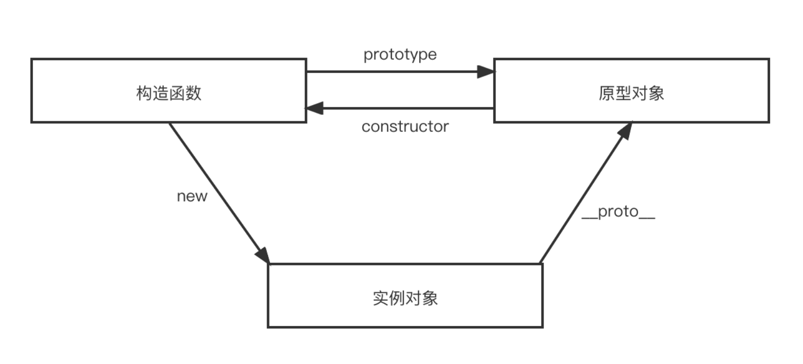
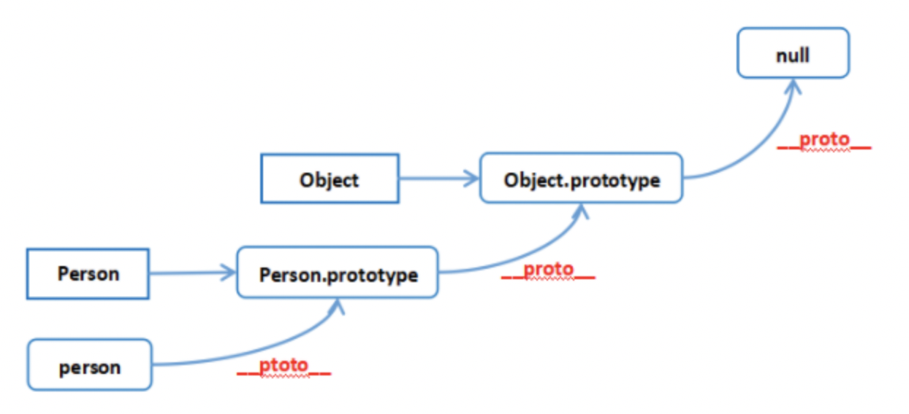

### 原型、原型链

    在 js 中我们使用构造函数来新建一个对象，每一个构造函数的内部都有一个 prototype 属性值，这个属性值是一个对象，这个对象包含了可以由该构造函数的所有实例共享的属性和方法。
    当我们使用构造函数新建一个对象后，在这个对象的内部将包含一个指针，这个指针指向构造函数的 prototype 属性对应的值，这个指针被称为对象的原型。

    当我们访问一个对象的属性时，如果这个对象内部不存在这个属性，那么它就会去它的原型对象里找这个属性，这个原型对象又会有自己的原型，于是就这样一直找下去，也就是原型链的概念。




### 例题

```js
Object.prototype.a = () => {
  console.log('a');
}
Function.prototype.b = () => {
  console.log('b');
}

function F(){}

var f = new F();

F.a(); // a
F.b(); // b
f.a(); // a
f.b(); // b is not a function
```
### 写到最后

> 一般会先问，再结合例题考察是否真的理解，如果不懂答案，可以参考文章：https://juejin.cn/post/7008526225207640078

